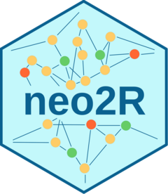

README
================

<!----------------------------------------------------------------------------->

<!----------------------------------------------------------------------------->

# neo2R 

[](https://cran.r-project.org/package=neo2R)
[](https://cran.r-project.org/package=neo2R)

The aim of neo2R is to provide simple and low-level connectors for
querying [Neo4j graph databases](https://neo4j.com/). The objects
returned by the query functions are either lists or data frames with
minimal post-processing, allowing fast handling of queries returning
many records and letting the user apply post-processing according to
their data model and needs. It has been developed to support the [BED
package](https://github.com/patzaw/BED)
([F1000Research](https://f1000research.com/articles/7-195/v3)). Other
packages such as [RNeo4j](https://github.com/nicolewhite/RNeo4j) or
[neo4R](https://github.com/neo4j-rstats/neo4r) provide connectors to
Neo4j databases with additional features.

<!----------------------------------------------------------------------------->

<!----------------------------------------------------------------------------->

# Installation

## From CRAN

``` r
install.packages("neo2R")
```

<!------------------------->

## Dependencies

The following R packages available on CRAN are required:

- [jsonlite](https://CRAN.R-project.org/package=jsonlite): A Simple and
  Robust JSON Parser and Generator for R
- [httr2](https://CRAN.R-project.org/package=httr2): Perform HTTP
  Requests and Process the Responses
- [utils](https://CRAN.R-project.org/package=utils): The R Utils Package

<!------------------------->

## Installation from github

``` r
devtools::install_github("patzaw/neo2R")
```

<!----------------------------------------------------------------------------->

<!----------------------------------------------------------------------------->

# Use

For detailed guides on using neo2R, please refer to the following
vignettes:

- **Neo4j Aura**: See [Getting Started with neo2R and Neo4j
  Aura](https://patzaw.github.io/neo2R/articles/neo2R-aura.html) for
  connecting to Neo4j’s fully managed cloud service, exploring the Movie
  Recommendations dataset, and visualizing networks.

- **Local Neo4j**: See [Using neo2R with Local Neo4j
  Instances](https://patzaw.github.io/neo2R/articles/neo2R-local.html)
  for connecting to local Neo4j instances, importing data from data
  frames, and querying databases.

- **Docker**: See [Running Neo4j with Docker
  Containers](https://patzaw.github.io/neo2R/articles/neo2R-docker.html)
  for setting up Neo4j in Docker containers (versions 3.x, 4.x, 5.x, and
  2025+), including SSL configuration and credential management.

To access vignettes from R, use:

``` r
browseVignettes("neo2R")
```
